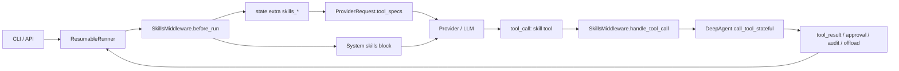

# RFC: Agent Skill Architecture for DeepAgentsRS

- Status: Draft
- Scope: `crates/deepagents`, `crates/deepagents-cli`
- Primary implementation anchors:
  - [`skills::loader`](../../../crates/deepagents/src/skills/loader.rs)
  - [`skills::validator`](../../../crates/deepagents/src/skills/validator.rs)
  - [`runtime::SkillsMiddleware`](../../../crates/deepagents/src/runtime/skills_middleware.rs)
  - [`runtime::ResumableRunner`](../../../crates/deepagents/src/runtime/resumable_runner.rs)
  - [`deepagents-cli skill *`](../../../crates/deepagents-cli/src/main.rs)

## Motivation

DeepAgentsRS now has a real skill system, but the existing design note still describes a generic
"skill manager" architecture that does not match the codebase. The current system already has:

- source-based skill package discovery from `--skills-source`
- strict validation of `SKILL.md` and optional `tools.json`
- model-visible injection through system prompt text and tool schemas
- runtime interception and guarded execution of skill tools
- CLI developer workflows for `skill init`, `skill validate`, and `skill list`

That makes a generic "skills are capability packages" document insufficient. What the project needs
now is an RFC that defines the actual seams, state model, control boundaries, and removal plan for
unpublished legacy seams in the current DeepAgentsRS system.

This RFC standardizes one central decision:

- Source-based skill packages are the only supported end-user skill architecture in DeepAgentsRS.
- The unpublished `SkillPlugin` / `AgentStep::SkillCall` path should be removed before the first
  public release instead of being carried as compatibility surface.
- Skills are not arbitrary code with direct backend access. They are declarative capability bundles
  that compile to controlled tool steps executed by the existing agent/runtime stack.

The design is intentionally trait-first and decomposed. DeepAgentsRS does not need a monolithic
"Skill Manager" object. Responsibility is already split across loader, validator, runtime
middleware, runner, and CLI surfaces, which is more idiomatic for Rust and easier to test.

## Requirements

### Functional requirements

- `R1` Multi-source discovery: the system must load skills from multiple sources, apply a clear
  override rule, and expose diagnostics about what won and what was skipped.
- `R2` Human-readable package format: a skill package must be inspectable on disk, with required
  metadata in `SKILL.md` and optional executable behavior in `tools.json`.
- `R3` Prompt-only support: a skill without `tools.json` must still participate in model-visible
  instruction injection.
- `R4` Model-visible invocation: executable skills must appear to the model as callable tool specs,
  not only as opaque prose.
- `R5` Controlled execution: skill execution must remain inside the existing tool/runtime control
  plane. Skills must not get direct access to `SandboxBackend`.
- `R6` Deny-by-default permissions: filesystem, command execution, and future network access must
  be explicitly allowed per skill tool policy.
- `R7` Global policy composition: skill execution must not bypass global approval, sandbox, or
  audit mechanisms already used by core tools.
- `R8` Bounded resources: skill execution must have bounded step count, timeout, and output size.
- `R9` Traceability: the system must surface which skills were loaded, which tool was invoked, and
  why a call failed.
- `R10` Subagent compatibility: skills must behave predictably when the `task` runtime middleware
  launches child runs.
- `R11` CLI ergonomics: the system must support bootstrapping, validating, and listing skills
  without starting a full interactive session.
- `R12` Single architecture: the first public release must expose one skill architecture centered
  on source-based packages; unpublished `SkillPlugin`, `AgentStep::SkillCall`, and `--plugin`
  surfaces should be removed rather than retained.
- `R13` Prompt-cache compatibility: any skill-driven change to provider-visible prefix messages or
  tool specs must be treated as a cache-key-relevant change, not as an invisible implementation
  detail.

### Quality requirements

- `Q1` Stable request assembly: tool exposure and prompt injection must be idempotent, canonically
  ordered, and deterministic across runs because prompt cache keys are derived from the assembled
  provider request.
- `Q2` Failure containment: malformed skill packages and runtime execution failures must be surfaced
  as explicit errors, not panics or silent fallthrough.
- `Q3` Explainable control boundaries: advisory fields in markdown must remain advisory; enforced
  permissions must come from machine-checked policy.
- `Q4` Rust-shaped extensibility: skill loading, validation, and execution seams must remain small,
  testable abstractions rather than a god-object interface.

### Non-goals

- Dynamic native-code loading.
- A remote skill registry, package signing service, or dependency solver.
- Semantic routing, embedding-based skill retrieval, or vector search.
- Per-skill custom sandboxes outside the existing tool/runtime pipeline.
- Full Python-parity for arbitrary imperative skills.

## Architecture

### High-level model

DeepAgentsRS skill architecture is split across four layers:

| Layer | Current component | Responsibility |
| --- | --- | --- |
| Package format | `SKILL.md`, `tools.json` | Human-readable metadata plus optional executable tool definitions |
| Discovery and validation | `skills::validator`, `skills::loader` | Parse packages, reject malformed input, merge sources, record diagnostics |
| Runtime integration | `runtime::SkillsMiddleware` | Load once, cache in state, inject model-visible skill context, intercept skill tool calls |
| Orchestration | `runtime::ResumableRunner` | Build provider requests, expose tool specs, execute tool calls, apply approval/audit/offload |

This decomposition replaces the earlier abstract "Skill Manager" concept. In the current system:

- package loading is synchronous and explicit
- runtime state is the handoff point between discovery and execution
- execution is mediated by `RuntimeMiddleware`
- actual side effects still happen through `DeepAgent` tools and existing middleware/policy hooks

### Primary runtime flow

### Architectural decisions

- Package skills are the default product path.
- Package skills are declarative macro-tools over existing tools, not arbitrary executables.
- Enforcement lives in runtime policy, not in markdown.
- Skill metadata and executable tool definitions are loaded once per run and cached in `state`.
- Providers should interact with skills through standard tool specs and tool calls, not through a
  separate skill-call protocol.
- Because DeepAgentsRS is not yet published, the legacy `SkillPlugin` path should be removed rather
  than preserved.

### Skill package contract

A source-based skill package is a directory under a configured source path.

Required shape:

- `<source>/<skill_name>/SKILL.md`

Optional shape:

- `<source>/<skill_name>/tools.json`

`SKILL.md` requirements:

- YAML frontmatter is mandatory and must be the first block.
- `name` and `description` are required.
- `license`, `compatibility`, `metadata`, and `allowed-tools` are optional.
- unknown frontmatter fields are rejected in strict mode.
- `name` must match the directory name and is constrained to lowercase ASCII, digits, and `-`.
- `SKILL.md` larger than 10 MiB is rejected.

`tools.json` requirements:

- top-level shape is `{ "tools": [...] }`
- tool entries include `name`, `description`, `input_schema`, optional `steps`, and optional
  `policy`
- unknown fields are rejected
- if `tools.json` is absent, the skill is prompt-only

The current policy struct is intentionally concrete:

- `allow_filesystem: bool = false`
- `allow_execute: bool = false`
- `allow_network: bool = false`
- `max_steps: usize = 8`
- `timeout_ms: u64 = 1000`
- `max_output_chars: usize = 12000`

Two important distinctions are part of the architecture:

- `allowed-tools` in `SKILL.md` is advisory and model-facing.
- `policy` in `tools.json` is enforced and runtime-facing.

### Discovery and override model

Skill discovery is file-based and source-ordered:

1. CLI passes one or more `--skills-source` directories.
2. `skills::loader::load_skills` walks each source and loads each skill directory through
   `skills::validator::load_skill_dir`.
3. If multiple sources provide the same skill name, the later source overrides the earlier one.
4. Diagnostics are captured as `SkillSourceDiagnostics` and `SkillOverrideRecord`.
5. Prompt-only skills remain in metadata even when they register no executable tools.

Tool-name handling is stricter than skill-name handling:

- conflicts with built-in core tool names fail fast
- conflicts between skill tools are merged with last-one-wins semantics
- the final runtime tool namespace is global, not per-skill

This is a deliberate design choice. The model sees a flat tool catalog, so DeepAgentsRS enforces a
flat executable namespace as well.

### Runtime assembly

The skill architecture is inserted into the existing runtime chain through
`RuntimeMiddlewareSlot::Skills`.

Current CLI assembly order is:

1. `TodoList`
2. `Memory`
3. `Skills`
4. `FilesystemRuntime`
5. `Subagents`
6. `Summarization`
7. `PromptCaching`
8. `PatchToolCalls`

That order matters:

- `SkillsMiddleware.before_run` must run early enough to populate `state.extra` before the runner
  builds provider requests.
- `FilesystemRuntimeMiddleware` can still post-process skill results, including large-result
  offload, because the runner applies offload after a middleware-handled tool call returns.
- `SubAgentMiddleware` receives the same runtime middleware chain, so child runs can reload or
  re-expose skills.
- `PromptCachingMiddleware` runs after skill injection in the current CLI assembly, which means the
  prompt-cache layer observes the final provider-visible prefix and tool catalog rather than a
  pre-skill request skeleton.

### State model

Source-based skills are materialized into three `AgentState.extra` keys:

- `skills_metadata`
- `skills_tools`
- `skills_diagnostics`

Prompt caching adds two more runtime-private keys that are relevant to skill architecture even
though they are not part of the skill snapshot itself:

- `_prompt_cache_options`
- `_provider_cache_events`

These keys form the internal runtime snapshot for package skills. `SkillsMiddleware.before_run`:

- loads from disk when the keys are absent or invalid
- reuses the serialized state snapshot when the keys are already present
- injects a system message with marker `DEEPAGENTS_SKILLS_INJECTED_V1` if it does not already
  exist

The injected block is intentionally simple and human-readable:

- heading `## Skills`
- one line per skill
- source attribution
- optional `Allowed tools:` advisory text from markdown metadata

This means DeepAgentsRS currently treats skill injection as a run-level snapshot, not a live view
of the filesystem after startup.

The prompt-cache keys are different in kind:

- `_prompt_cache_options` configures how provider requests are cached
- `_provider_cache_events` records cache telemetry that is later attached to `RunOutput.trace`

They should be treated as runtime-private state, not user or child-agent business state.

### Model-visible skill exposure

Package skills are exposed to providers in two ways.

First, `SkillsMiddleware.before_run` inserts a system message describing available skills.

Second, `ResumableRunner::agent_tools` appends `skills_tools` to the built-in tool catalog on every
provider step. This is the mechanism that makes source-based skills visible to LLM-backed providers,
because real providers consume `tool_specs`.

The released architecture should expose a single kind of "skill visibility":

- package skills: visible as tool specs plus a system block

Any remaining request fields or cache keys that mention abstract `skills` are cleanup debt from the
unpublished compatibility path and should be removed or treated as internal migration detail rather
than a supported architectural seam.

### Prompt cache interaction

Prompt caching is now part of the skill architecture contract, not an unrelated runtime feature.

The active flow is:

1. runtime middlewares finish mutating messages and `state`
2. the runner builds `AgentProviderRequest`
3. `PromptCachingMiddleware` ensures `_prompt_cache_options` exists and clears prior
   `_provider_cache_events`
4. the provider-specific prompt-cache plan is built from the final request shape
5. L1/L2 cache keys are derived from stable JSON views of that request

For LLM-backed providers, the cache plan is computed from the adapted request after provider
translation. In practice that means:

- L1 includes provider-visible prefix messages and `tool_specs`
- L2 includes the non-prefix message suffix and summarization state

This has two architectural consequences.

First, package skills directly affect L1 reuse because they change both:

- the injected system-prefix block
- the final tool catalog exposed through `tool_specs`

Second, request stability is no longer just a documentation nicety. Any nondeterminism in skill
ordering or injection formatting becomes prompt-cache churn.

There is one cleanup seam to acknowledge during removal of the unpublished plugin path:

- the generic fallback `PromptCachePlan::from_agent_request` still includes `req.skills`

The RFC standardizes the stronger rule: cache compatibility should be defined solely in terms of
the effective provider request, not in terms of dead or non-provider-visible compatibility fields.

### Skill execution model

Package skill execution is implemented as runtime interception, not as a separate executor service.

When the provider emits a tool call whose name matches a loaded skill tool:

1. `SkillsMiddleware.handle_tool_call` intercepts it.
2. The input is validated against the declared `input_schema`.
3. The declared step count is checked against `policy.max_steps`.
4. The full skill call runs under a `tokio::time::timeout(policy.timeout_ms)`.
5. Each declared step is executed sequentially.
6. Per-step arguments are formed by overlaying the caller input onto the step template.
7. Side effects happen through `DeepAgent.call_tool_stateful` or the explicit `execute` approval
   path.
8. The last step output becomes the skill tool result.
9. The skill-local output is truncated according to `policy.max_output_chars`.
10. The runner then treats the result like any other tool result, including optional large-result
    offload.

Consequences of this model:

- package skills are sequential, not concurrent
- package skills inherit existing tool-side middleware behavior
- package skills cannot directly access the backend
- package skills are bounded by the same approval and audit machinery used by `execute`

### Permission model

Permission enforcement is layered.

Package skill policy enforces:

- filesystem steps require `allow_filesystem=true`
- `execute` requires `allow_execute=true`
- `allow_network` is reserved for future network-capable tools

Global runtime policy still applies:

- `execute` steps are evaluated through the active `ApprovalPolicy`
- denials are converted into `command_not_allowed:*`
- allowed commands are recorded through the configured `AuditSink`
- the backend still enforces root/path and shell allow-list semantics

This is the central security property of the architecture: a skill can request a sensitive action,
but it cannot define the final permission boundary.

### Relationship to runtime-only tools

DeepAgentsRS exposes some capabilities as runtime-handled tools, such as `task` and
`compact_conversation`. Those appear in provider-facing tool specs, but package-skill steps execute
through `DeepAgent.call_tool_stateful`, which only knows about agent-owned tools.

Therefore, the current architecture supports this split:

- the model may call runtime-handled tools directly
- `tools.json` steps should be understood as compositions over `DeepAgent` tools, not over the full
  runtime tool surface

This is a real architectural boundary and should remain explicit.

### Subagents and isolation

Subagents reuse the same runtime middleware chain, including `SkillsMiddleware`. The child run
starts with filtered state and a fresh user message derived from the task description.

The intended isolation rule is:

- long parent message history is not copied
- sensitive private state should not leak into the child
- skill metadata should not be blindly inherited

The code partially enforces this today by excluding `skills_metadata` from child state, but the
architecture should be read as stronger than the current implementation: the skill snapshot and the
prompt-cache runtime keys (`_prompt_cache_options`, `_provider_cache_events`) are run-scoped
concerns and should not accidentally bleed into child state through unrelated keys.

### CLI and operational surfaces

The current CLI surface is already part of the architecture, not an afterthought:

- `deepagents skill init <dir>` creates a minimal package scaffold
- `deepagents skill validate --source <dir>...` loads and validates packages without running a
  provider loop
- `deepagents skill list --source <dir>...` emits `skills`, `tools`, and `diagnostics`
- `deepagents run --skills-source <dir>...` wires package skills into the runtime

These commands are important because they provide the operational lifecycle that a pure in-memory
skill system would lack: authoring, validation, inspection, and execution all have concrete entry
points.

The released CLI should not expose a separate `--plugin` path for unpublished legacy skills. The
package workflow is the only user-facing authoring and execution model.

### Removal of unpublished `SkillPlugin` path

Because DeepAgentsRS is not yet published, the pre-package `SkillPlugin` mechanism should be
removed instead of being retained as a "legacy" surface.

That removal includes:

- removing `SkillPlugin` as part of the supported architecture story
- removing `AgentStep::SkillCall` as a supported provider contract
- removing CLI/help references to `run --plugin`
- migrating tests and fixtures to package skills or ordinary tool calls
- routing any future alternative execution backend through the package and tool-spec pipeline rather
  than reviving a second invocation protocol

This is the lower-risk choice pre-release because it avoids shipping two architectures with
different naming, visibility, cache behavior, and CLI ergonomics.

## Alternatives

### Alternative A: Prompt-only skills

Treat every skill as markdown injected into the system prompt and stop there.

Why not:

- no executable contract
- weak auditability
- no permission boundary
- poor reuse of existing tool/runtime stack

### Alternative B: Retain the unpublished `SkillPlugin` seam

Continue carrying `AgentStep::SkillCall -> SkillPlugin -> tool_calls` as a second skill path.

Why not:

- no shipped compatibility obligation exists yet
- it preserves two model-visibility mechanisms (`tool_specs` vs `skills`)
- it keeps `AgentStep::SkillCall` in the provider protocol even though released providers should use
  normal tool calling
- it forces CLI/help output to explain a path that new users should never adopt

### Alternative C: Subagent-per-skill

Run every skill inside a dedicated subagent.

Why not:

- heavier prompt and token cost
- more complex trace and state-merge behavior
- unnecessary isolation for simple macro-tools

This remains a valid future strategy for high-risk or long-running skills, but it is not the right
default.

### Alternative D: WASM-first skills

Make every skill a WASM module from day one.

Why not now:

- larger implementation surface
- harder developer workflow
- package lifecycle, validation, and UX were more urgent than a new execution runtime

Future WASM-backed skills can still fit this architecture, but they should integrate through the
same package, validation, tool-spec, and runtime-control pipeline rather than by reviving a second
skill-call protocol.

## Risks

- Removal migration debt: if `AgentStep::SkillCall`, `req.skills`, or `--plugin` remain partially
  wired during cleanup, docs, help text, tests, and cache behavior can drift from the intended
  single-path architecture.
- Ordering instability: the current loader uses hash maps, so final metadata/tool order is not
  strongly deterministic even though the user-facing contract and prompt-cache layer both want
  stable ordering.
- Prompt growth: all loaded package skills are injected into the run snapshot; there is no routing
  or selective loading yet.
- Prompt-cache churn: because cache keys are derived from prefix messages and tool specs,
  nondeterministic skill ordering or formatting directly reduces L1 reuse.
- Schema-validation gap: runtime input validation currently checks only a small JSON-schema subset
  (`type`, `properties`, `required`).
- Advisory/enforced split drift: `allowed-tools` in markdown can fall out of sync with executable
  `policy`.
- Network policy is reserved but not meaningful until network-capable tools exist.
- Runtime-tool mismatch: package steps cannot reliably target runtime-only tools such as `task` or
  `compact_conversation`.
- Partial isolation: child-state filtering currently excludes `skills_metadata` but not every
  skill-related or prompt-cache-related key.
- Prompt-cache cleanup lag: if generic cache planning continues hashing `req.skills` after the
  compatibility path is removed, cache keys will still encode dead request state.
- Supply-chain hardening is incomplete: the validator rejects symlinked skill directories, but file-
  level integrity and versioned package provenance are not fully modeled.
- Session stability is snapshot-based but not versioned: there is no explicit skill package version
  or immutable registry reference in state.

## Open Questions

- Should `skills_tools` and `skills_diagnostics` be excluded from child state alongside
  `skills_metadata`?
- Should `_prompt_cache_options` and `_provider_cache_events` also be treated as excluded private
  runtime state for subagents?
- Should loader output be explicitly sorted to guarantee stable tool ordering across platforms and
  runs, especially for prompt-cache L1 stability?
- Should runtime validation move from the current lightweight JSON-schema subset to a stricter
  validator shared with `tools.json` loading?
- Should `allowed-tools` remain an advisory markdown field, or should the system collapse
  user-facing guidance and enforced policy into one source of truth?
- Should package skill steps be allowed to call runtime-handled tools, and if so, through what
  abstraction?
- Should skill output prefer global offload over local truncation for large responses, or should
  truncation remain the default package-level behavior?
- How should versioning work for long-lived sessions: package hash, semantic version, or a fully
  serialized in-state snapshot?
- When network tools exist, should `allow_network` be enforced at the step level, the backend
  level, or both?

## Summary

DeepAgentsRS should treat source-based skill packages as its only released skill architecture. The
current system already has the right Rust-shaped seams for that:

- strict on-disk package validation
- runtime middleware integration instead of a monolithic skill manager
- execution through existing tool, approval, and audit pipelines
- CLI lifecycle support
- one model-visible invocation path based on tool specs and tool calls

The next step is not inventing a new architecture. It is tightening the current one: remove the
unpublished `SkillPlugin` / `AgentStep::SkillCall` / `--plugin` path, stabilize ordering, harden
isolation, make prompt-cache boundaries explicit, and decide how much more expressive skill
execution needs to become.
