# RFC: Agent Skill Architecture for DeepAgentsRS

- Status: Draft
- Scope: `crates/deepagents`, `crates/deepagents-cli`
- Current implementation anchors:
  - [`skills::loader`](../../../crates/deepagents/src/skills/loader.rs)
  - [`skills::validator`](../../../crates/deepagents/src/skills/validator.rs)
  - [`runtime::SkillsMiddleware`](../../../crates/deepagents/src/runtime/skills_middleware.rs)
  - [`runtime::ResumableRunner`](../../../crates/deepagents/src/runtime/resumable_runner.rs)
  - [`subagents`](../../../crates/deepagents/src/subagents)
  - [`deepagents-cli`](../../../crates/deepagents-cli/src/main.rs)
- Planned implementation anchors:
  - `skills::registry`
  - `skills::selection`
  - `skills::assembly`
  - `skills::governance`
  - `runtime::SkillAuditMiddleware`

## Motivation

DeepAgentsRS already has a real skill system, but the previous RFC described only the parts that
match the current codebase: source-based package loading, prompt injection, tool exposure, guarded
execution, and CLI authoring workflows. That was enough to document the implementation that exists
today, but it did not fully satisfy the broader architecture goals described in
`agent-skill-architecture-design.md`.

This RFC closes that gap. It standardizes the full release architecture for skills in
DeepAgentsRS, including:

- lifecycle management
- version coexistence and rollback
- selection and activation as concepts distinct from installation
- structured fragment assembly instead of full-package prompt injection
- bounded context capsules for isolated execution
- semantic governance review and quarantine
- explicit audit records for selection, execution, and policy outcomes
- CLI surfaces that make the full architecture testable end to end

The result is a design that still matches Rust-first implementation seams, but now fully delivers
the architecture goals of a governed capability platform rather than only a runtime macro-tool
system.

## Central Decisions

- Source-based skill packages remain the single released end-user authoring format.
- Skills are declarative capability bundles, not arbitrary code with direct backend access.
- Installing a skill, enabling a skill, selecting a skill, and granting permissions are distinct
  steps with separate control boundaries.
- The design-doc concept of a "Skill Manager" is preserved as a responsibility boundary, but it is
  implemented as a composed skill control plane rather than a god object.
- Skills are versioned and coexist by version. Ongoing sessions bind to a resolved skill snapshot.
- Only selected skills become provider-visible during a run. Installed-but-unselected skills do not
  expand the prompt or tool catalog.
- High-risk or runtime-only capabilities execute through isolated subagent flows with bounded
  context capsules.
- Unpublished `SkillPlugin`, `AgentStep::SkillCall`, and `--plugin` surfaces must be removed before
  the first public release.

## Requirements

### Functional requirements

- `R1` Multi-source discovery: the system must load skills from multiple sources, apply a clear
  override rule for ad hoc source overlays, and expose diagnostics about what won and what was
  skipped.
- `R2` Human-readable package format: a skill package must be inspectable on disk, with required
  metadata in `SKILL.md`, optional executable behavior in `tools.json`, and optional lazy-loaded
  references, templates, and examples in package subdirectories.
- `R3` Prompt-only support: a skill without `tools.json` must still participate in routing,
  activation, and model-visible instruction injection.
- `R4` Model-visible invocation: executable skills must appear to the model as callable tool specs,
  not only as opaque prose.
- `R5` Controlled execution: skill execution must remain inside the existing tool/runtime control
  plane. Skills must not get direct access to `SandboxBackend`.
- `R6` Deny-by-default permissions: filesystem, command execution, and future network access must
  be explicitly allowed per skill tool policy.
- `R7` Global policy composition: skill execution must not bypass global approval, sandbox, audit,
  or root-boundary mechanisms already used by core tools.
- `R8` Bounded resources: skill execution must have bounded step count, timeout, output size, and
  activation fan-out.
- `R9` Traceability: the system must surface which skills were installed, available, selected, and
  executed; why a skill was selected or skipped; which fragments were loaded; which tool was
  invoked; and why a call failed.
- `R10` Subagent compatibility: skills must behave predictably when the `task` runtime middleware
  launches child runs, including bounded context transfer and filtered child state.
- `R11` CLI ergonomics: the system must support bootstrapping, validating, listing, installing,
  enabling, disabling, quarantining, resolving, and auditing skills without requiring direct Rust
  API usage.
- `R12` Single architecture: the first public release must expose one skill architecture centered
  on source-based packages; unpublished `SkillPlugin`, `AgentStep::SkillCall`, and `--plugin`
  surfaces should be removed rather than retained.
- `R13` Prompt-cache compatibility: any skill-driven change to provider-visible prefix messages,
  selected fragments, or tool specs must be treated as a cache-key-relevant change.
- `R14` Selection/activation separation: installation and availability must not imply activation.
  Routing must decide whether a skill should be activated for a specific run or step.
- `R15` Structured assembly: only the fragments relevant to the current task may be loaded into the
  provider-visible request. The architecture must not inject entire installed libraries by default.
- `R16` Lifecycle states: skills must support install, enable, disable, quarantine, remove, and
  rollback. Multiple versions of the same skill must be able to coexist.
- `R17` Runtime stability: long-lived sessions must bind to a resolved skill snapshot until an
  explicit refresh or migration occurs.
- `R18` Governance review: skill installation and validation must cover both structural correctness
  and semantic safety review, with quarantine support when review fails or risk changes after
  install.
- `R19` Post-execution audit: audit records must include selection rationale, consumed inputs, tool
  attempts, policy denials, abnormal resource usage, and output provenance.
- `R20` Context capsules: when a skill executes in isolation, the main run must pass a bounded
  context capsule rather than the entire conversation history.

### Quality requirements

- `Q1` Stable request assembly: skill exposure, fragment ordering, and prompt injection must be
  idempotent, canonically ordered, and deterministic across runs because prompt cache keys are
  derived from the assembled provider request.
- `Q2` Failure containment: malformed skill packages, governance failures, routing failures, and
  runtime execution failures must be surfaced as explicit errors or trace events, not panics or
  silent fallthrough.
- `Q3` Explainable control boundaries: advisory fields in markdown must remain advisory; enforced
  permissions must come from machine-checked policy.
- `Q4` Rust-shaped extensibility: skill loading, registry, selection, assembly, execution, policy,
  and audit seams must remain small, testable abstractions rather than one monolithic interface.
- `Q5` Token discipline: a large installed skill library must not translate into a large runtime
  prompt or unstable cache key churn.
- `Q6` Release testability: every release-facing lifecycle and runtime behavior in this RFC must be
  testable through `deepagents-cli` black-box E2E coverage.

### Non-goals

- Dynamic native-code loading.
- A remote skill marketplace, dependency solver, or cloud signing service.
- Embedding-based retrieval or vector search as the only routing strategy.
- Per-skill bespoke sandboxes outside the existing runtime policy pipeline.
- Full Python-parity for arbitrary imperative skill code.

## Architecture

### High-level model

The released DeepAgentsRS skill architecture is split across seven layers:

| Layer | Release responsibility | Current / planned implementation seam |
| --- | --- | --- |
| Package format | Human-readable metadata, fragments, references, tools | `SKILL.md`, `tools.json`, package subdirs |
| Registry and lifecycle | Install, enable, disable, quarantine, remove, version coexistence | planned `skills::registry`, CLI `skill install`/`enable`/`disable`/`quarantine`/`remove`/`versions`/`status` |
| Discovery and validation | Load packages, reject malformed input, record diagnostics | `skills::validator`, `skills::loader`, planned `skills::governance` |
| Selection and assembly | Candidate ranking, deterministic activation, fragment loading, context capsule preparation | planned `skills::selection`, `skills::assembly`, CLI `skill resolve` |
| Runtime integration | Cache snapshots in state, expose selected skills, intercept skill tool calls | `runtime::SkillsMiddleware`, `runtime::ResumableRunner` |
| Policy engine | Enforce runtime permissions and approval boundaries | existing approval, sandbox, and tool policies |
| Audit engine | Record selection, execution, policy, and resource traces | existing audit sink plus planned `runtime::SkillAuditMiddleware` |

This is the Rust-shaped realization of the design-doc "Skill Manager" model. The architecture keeps
the responsibility separation, but it does not require one god object. Instead:

- the skill control plane owns registry, selection, assembly, and lifecycle
- the policy engine owns enforcement
- the audit engine owns trace capture and evaluation
- the runtime owns provider request construction and tool execution

### Primary control-plane flow

```mermaid
flowchart LR
    Source["Source package(s)"] --> Validate["Validate + governance review"]
    Validate --> Registry["Registry / lifecycle store"]
    Registry --> Resolve["Selection + activation"]
    Resolve --> Assemble["Fragment assembly + context capsule"]
    Assemble --> Runner["ResumableRunner"]
    Runner --> Provider["Provider / LLM"]
    Provider --> ToolCall["Tool call"]
    ToolCall --> SkillsExec["SkillsMiddleware / skill executor"]
    SkillsExec --> Policy["Approval + sandbox policy"]
    Policy --> Core["DeepAgent tools / subagent run"]
    Core --> Audit["Audit + trace"]
    Audit --> Runner
```



### Architectural decisions

- Package skills are the only released product path.
- Package skills remain declarative macro-tools over existing tools and runtime surfaces.
- Installing a package is not equivalent to enabling it, selecting it, or trusting it.
- The registry stores versioned skill identities and lifecycle state.
- The selector activates only relevant skills for a run or provider step.
- The assembler injects only selected fragments and tool specs into the provider-visible request.
- Markdown guidance is advisory; machine-checked policy is enforced.
- Runtime-only capabilities are not callable directly from inline skill steps; they require an
  isolated subagent execution path.
- Ongoing sessions bind to a resolved snapshot rather than following live filesystem changes.
- Prompt-cache keys are derived from the effective provider request after selection and assembly,
  not from installed-but-unused skill inventory.

## Skill Package Contract

### Package layout

A source-based skill package is a directory under a configured source path.

Required shape:

- `<source>/<skill_name>/SKILL.md`

Optional shape:

- `<source>/<skill_name>/tools.json`
- `<source>/<skill_name>/references/**`
- `<source>/<skill_name>/examples/**`
- `<source>/<skill_name>/templates/**`

The package remains readable as ordinary files. No binary packaging step is required for local
authoring, validation, or installation.

### `SKILL.md` contract

YAML frontmatter is mandatory and must be the first block.

Required frontmatter fields:

- `name`
- `version`
- `description`

Optional frontmatter fields:

- `license`
- `compatibility`
- `metadata`
- `allowed-tools`
- `triggers`
- `risk-level`
- `output-contract`
- `default-enabled`
- `requires-isolation`

Validation rules:

- `name` must match the directory name and is constrained to lowercase ASCII, digits, and `-`
- `version` must be valid semver
- unknown frontmatter fields are rejected in strict mode
- `SKILL.md` larger than 10 MiB is rejected
- path references must remain inside the package root

`SKILL.md` is also the structured fragment source. The release parser recognizes logical sections
by heading and stores them as named fragments:

- `## Role`
- `## When to Use`
- `## Inputs`
- `## Constraints`
- `## Workflow`
- `## Output`
- `## Examples`
- `## References`

Not every section is mandatory, but the package must provide enough structured content for routing,
assembly, and audit to work. This is how DeepAgentsRS satisfies the design goal of structured
fragments instead of monolithic prompt text.

### `tools.json` contract

`tools.json` remains optional. If present, the top-level shape is:

```json
{ "tools": [ ... ] }
```

Tool entries include:

- `name`
- `description`
- `input_schema`
- optional `steps`
- optional `policy`

Unknown fields are rejected in strict mode.

If `tools.json` is absent, the skill is prompt-only and may still be selected and activated.

### References, examples, and templates

Optional package directories satisfy the design requirement for reusable references and templates:

- `references/` stores long-form reference material that may be lazily loaded
- `examples/` stores worked examples for conditional inclusion
- `templates/` stores reusable output or file templates

These assets are never loaded eagerly for every run. The assembler pulls them only when the
selection result requests them.

### Policy contract

The initial machine-checked skill-tool policy remains intentionally concrete:

- `allow_filesystem: bool = false`
- `allow_execute: bool = false`
- `allow_network: bool = false`
- `max_steps: usize = 8`
- `timeout_ms: u64 = 1000`
- `max_output_chars: usize = 12000`

Two distinctions remain central:

- `allowed-tools` in `SKILL.md` is advisory and model-facing
- `policy` in `tools.json` is enforced and runtime-facing

## Lifecycle Model

The release lifecycle is explicit and stateful.

### Installation

The package is validated, semantically reviewed, hashed, and copied or registered into a local
registry.

### Availability

The package becomes discoverable in the registry, but it is not automatically active for every run.

### Enable / Disable

Enabled packages are eligible for selection. Disabled packages remain installed and versioned, but
the selector skips them by default.

### Selection

The selector ranks candidates for the current task and chooses a bounded set of active skills.

### Assembly

Only the selected skill fragments, tool specs, and required references are loaded into the
provider-visible request.

### Execution

The skill executes inline or through an isolated subagent path, depending on risk and capability
requirements.

### Audit

Selection rationale, fragment usage, tool attempts, policy outcomes, and resource usage are logged.

### Quarantine

Quarantined skills remain installed for investigation and rollback, but are not eligible for normal
selection.

### Removal

Packages can be removed from the registry. Removal does not rewrite existing thread snapshots.

## Discovery, Registry, Versioning, and Override Model

### Discovery modes

DeepAgentsRS supports two discovery modes:

- dev overlay mode: repeatable `--skills-source <dir>` loads packages directly from source
  directories for ad hoc development and testing
- registry mode: `--skill-registry <dir>` resolves installed, versioned packages from a local
  registry

The release path is registry-first. `--skills-source` remains important for development, fixture
authoring, and black-box E2E tests, but it is treated as a dev overlay rather than the sole
operational lifecycle.

### Registry model

The local registry stores:

- versioned package identity `name@version`
- package content hash
- provenance (`installed_from`, install timestamp, review status)
- lifecycle state (`enabled`, `disabled`, `quarantined`)
- compatibility metadata

Multiple versions of the same skill coexist.

### Override model

Override rules differ by mode:

- within direct source discovery, later `--skills-source` entries override earlier ones for the
  same `name@version`, and diagnostics record the winner
- within the registry, versions coexist and do not overwrite one another
- when both registry and direct sources are used in one run, direct sources act as an explicit dev
  overlay and must be recorded in diagnostics and the resolved snapshot

### Runtime stability

At run start, the system resolves a skill snapshot. The snapshot includes:

- exact skill versions
- content hashes
- lifecycle state at resolution time
- selected fragment IDs

Ongoing sessions bind to that snapshot until:

- a new thread is started
- the user explicitly requests a refresh
- a migration command rewrites the snapshot

This satisfies the architecture requirement that installation or removal events do not arbitrarily
disrupt ongoing conversations.

## Selection, Routing, and Assembly

### Candidate set

The selector starts from:

- enabled, non-quarantined skills in the registry
- explicit `--skill <name[@version]>` pins supplied for the run
- direct-source overlays for the current run

Hard filters remove packages that are:

- incompatible with the runtime or platform
- quarantined
- outside the allowed risk or isolation profile for the run
- incompatible with explicit disable flags

### Deterministic routing

The initial router is deterministic and explainable. It ranks candidates using:

- explicit user pins
- trigger hints from frontmatter
- lexical matches against the user request
- requested output contract
- required tool scope
- prior thread snapshot affinity

Tie-breakers must be stable:

1. higher explicitness
2. higher relevance score
3. lower risk level
4. lexicographic `name`
5. lexicographic `version`

This is intentionally simpler than semantic retrieval. The requirement is explainability and stable
cache behavior, not hidden heuristics.

### Activation limits

The selector activates at most `N` skills for a run, where `N` is controlled by:

- default runtime policy
- `--skill-max-active <n>`
- per-skill activation metadata when present

This is a core token-management boundary.

### Structured assembly

The assembler loads only the fragments relevant to the selection result:

- base fragments: `Role`, `When to Use`, `Constraints`, `Workflow`, `Output`
- optional fragments: `Examples`, `References`, `Templates`

The assembler must not inject:

- every installed skill
- every fragment of a selected skill
- large references that were not requested

This is the concrete realization of layered loading, delayed expansion, and fragment caching.

### Selection trace

Both `skill resolve` and `run --explain-skills` must expose a stable selection report:

```json
{
  "skills": {
    "snapshot_id": "sha256:...",
    "candidates": [
      {
        "name": "read-readme",
        "version": "1.0.0",
        "score": 12,
        "reasons": ["keyword:readme", "output:first_line_text"]
      }
    ],
    "selected": [
      {
        "name": "read-readme",
        "version": "1.0.0",
        "fragments": ["role", "workflow", "output"],
        "tool_names": ["read-readme"],
        "execution_mode": "inline"
      }
    ],
    "skipped": [
      {
        "name": "shell-runner",
        "version": "1.0.0",
        "reason": "quarantined"
      }
    ]
  }
}
```

This report is required for auditability and E2E coverage.

## Context Capsules and Isolation

### Capsule contract

When a skill executes in isolation, the parent run passes a bounded context capsule rather than the
full conversation history.

The capsule contains:

- task objective
- relevant user inputs
- summarized recent context
- explicit constraints
- output expectations
- allowed tool scope
- selected skill identity and version

The capsule excludes unrelated parent messages and private runtime-only state.

### Isolation levels

The release architecture supports two default execution modes:

- `inline`: the skill is an ordinary macro-tool over `DeepAgent` tools
- `subagent`: the skill runs through the `task` runtime path with a fresh child run and a bounded
  capsule

The selector chooses or enforces isolation based on:

- skill risk level
- tool usage
- data sensitivity
- execution complexity
- `requires-isolation` metadata

### Child-state filtering

Child runs must not inherit skill or prompt-cache bookkeeping. The filtered set includes:

- `skills_metadata`
- `skills_tools`
- `skills_diagnostics`
- `_prompt_cache_options`
- `_provider_cache_events`
- other parent-only runtime keys such as `messages`, `todos`, and `structured_response`

This rule is already compatible with the current subagent filter implementation and is now part of
the formal architecture, not an accidental behavior.

### Runtime-only tools

Runtime-only tools such as `task` and `compact_conversation` are not valid inline package-step
targets.

If a skill requires runtime-only behavior, it must execute in `subagent` mode through the bounded
capsule path instead of attempting to call runtime-only tools directly from `tools.json`.

## Model-Visible Exposure and Execution Model

### Visibility contract

Providers see selected skills in exactly two ways:

- a system/developer block describing selected skills and their active fragments
- executable tool specs for selected skill tools

Installed-but-unselected skills are not injected into the provider-visible request.

### Execution flow

When the provider emits a tool call whose name matches a selected skill tool:

1. `SkillsMiddleware.handle_tool_call` intercepts it
2. the input is validated against the declared schema
3. the declared step count is checked against `policy.max_steps`
4. the skill call runs under `tokio::time::timeout(policy.timeout_ms)`
5. inline steps execute sequentially
6. side effects flow through `DeepAgent.call_tool_stateful` or the approval-gated `execute` path
7. the output is truncated by `policy.max_output_chars`
8. the runner treats the result like any other tool result, including optional large-result offload

For `subagent` mode, the skill executor converts the selection result into a `task` launch with a
bounded capsule and returns the child run result as the skill output.

### Tool namespace

The provider sees a flat tool catalog. DeepAgentsRS therefore keeps a flat executable namespace for
selected skill tools.

Conflict rules:

- conflicts with built-in core tool names fail fast
- conflicts between selected skill tools fail fast unless an explicit override policy resolves them
- conflicts that arise only in disabled or non-selected versions do not affect the current run

## Permission and Policy Model

Permission enforcement remains layered.

### Skill-local policy

Package skill policy enforces:

- filesystem steps require `allow_filesystem=true`
- `execute` requires `allow_execute=true`
- future network-capable steps require `allow_network=true`
- step count, timeout, and output size bounds

### Global runtime policy

Global runtime policy still applies:

- `execute` steps are evaluated through the active `ApprovalPolicy`
- denials become stable `command_not_allowed:*` or equivalent policy errors
- allowed commands are recorded through the configured `AuditSink`
- the backend still enforces root/path and shell allow-list boundaries

### Governance interaction

Skill-local policy cannot escalate a run beyond what the platform permits. Semantic review may also
upgrade risk or force quarantine even if the package is structurally valid.

This preserves the central design principle: a skill may request a sensitive action, but it cannot
define the final permission boundary.

## Governance and Validation

Validation is two-layered.

### Structural validation

Structural validation checks:

- required files and frontmatter fields
- schema shape and unknown-field rejection
- path containment
- version syntax
- tool conflict rules
- rejection of inline runtime-only tools

### Semantic governance review

Semantic review checks for patterns such as:

- instructions that attempt to override system or developer policy
- mismatches between advisory markdown and executable policy
- suspicious privilege expansion claims
- references that imply unrestricted external access
- prompt-only skills that claim capabilities with no governed execution path

Semantic-review outcomes:

- `pass`
- `warn`
- `fail`

`warn` keeps the package installable but review-visible. `fail` blocks enablement and places the
package in quarantine until explicitly reviewed.

### Quarantine workflow

Quarantine can be triggered by:

- failed semantic review
- manual operator action
- runtime audit findings
- provenance or integrity mismatch

Quarantined packages stay installed for explainability and rollback, but the selector skips them by
default and records the skip reason.

### Supply-chain integrity

This RFC does not require a remote signing service, but it does require local provenance and file
integrity tracking:

- package content hash at install time
- provenance record in the registry
- mismatch detection if a supposedly immutable installed package changes on disk

## Audit and Observability

### Audit record requirements

Post-execution audit must evaluate more than the final output. The release audit record includes:

- thread ID and run ID
- resolved skill snapshot ID
- candidate list and selection rationale
- selected fragments and references
- consumed user inputs or files
- tool usage attempts
- policy denials
- abnormal resource usage
- output provenance
- quarantine-worthy findings

### Runtime trace

The run output trace must contain:

- `trace.skills` for selection and execution summary
- `trace.provider_cache_events` for prompt-cache behavior
- ordinary tool-call and tool-result traces

### Event stream

When `--events-jsonl` or `--stream-events` is enabled, the event stream should include skill-aware
events such as:

- `skill_selection_started`
- `skill_selected`
- `skill_skipped`
- `skill_tool_call_started`
- `skill_tool_call_finished`
- `skill_quarantined`

Stable event names make black-box E2E tests and operator automation practical.

## Prompt Cache Interaction

Prompt caching is part of the skill architecture contract.

Cache-key-relevant inputs include:

- selected skill identities and versions
- selected fragment IDs and assembled injection formatting
- selected skill tool specs
- provider-visible prefix messages

Installed-but-unselected skills are not cache-key-relevant.

This has three consequences:

- routing must be deterministic
- fragment ordering must be canonical
- skill selection must be visible in trace so cache misses can be explained

The generic fallback that hashes dead `req.skills` compatibility fields must be removed as part of
the unpublished plugin-path cleanup.

## State Model

The release state model centers on explicit snapshots.

Required run-level state keys:

- `skills_snapshot`
- `skills_selection`
- `skills_diagnostics`
- `_prompt_cache_options`
- `_provider_cache_events`

`skills_snapshot` stores the resolved catalog view for the thread or run, including exact versions
and hashes.

`skills_selection` stores the per-run or per-step selected skills, fragments, and execution modes.

`skills_diagnostics` stores discovery, validation, override, and governance diagnostics.

The current `skills_metadata` and `skills_tools` keys remain acceptable as internal migration
helpers, but they are not the final architectural contract. The release architecture should expose
the snapshot and selection model directly.

## CLI and Operational Surfaces

The CLI is part of the architecture, not an afterthought. The following commands define the
release-facing operational lifecycle.

### Existing commands retained

- `deepagents skill init <dir> [--pretty]`
- `deepagents skill validate --source <dir>... [--pretty]`
- `deepagents skill list --source <dir>... [--pretty]`
- `deepagents run --skills-source <dir>... ...`

### Required additions

- `deepagents skill install --source <dir>... --registry <dir> [--pretty]`
- `deepagents skill status --registry <dir> [--pretty]`
- `deepagents skill versions <name> --registry <dir> [--pretty]`
- `deepagents skill enable <name[@version]> --registry <dir> [--pretty]`
- `deepagents skill disable <name[@version]|name> --registry <dir> [--pretty]`
- `deepagents skill quarantine <name[@version]> --registry <dir> --reason <text> [--pretty]`
- `deepagents skill remove <name[@version]> --registry <dir> [--pretty]`
- `deepagents skill resolve --registry <dir> --input <text> [--skill <name[@version]>]... [--disable-skill <name>]... [--pretty]`
- `deepagents skill audit --thread-id <id> --root <dir> [--pretty]`

### Required `run` flags

- `--skill-registry <dir>`
- repeatable `--skill <name[@version]>`
- repeatable `--disable-skill <name>`
- `--skill-select auto|manual|off`
- `--skill-max-active <n>`
- `--explain-skills`
- `--refresh-skill-snapshot`
- `--state-file <path>`

Existing `--skills-source`, `--prompt-cache`, `--events-jsonl`, `--stream-events`, `--thread-id`,
`--execution-mode`, `--audit-json`, and `--shell-allow` remain important and are part of the E2E
plan below.

## E2E Test Strategy

The release architecture must be provable from the CLI crate with black-box tests. This section is
normative because the missing pieces in the previous RFC were largely untestable from the
user-facing surface.

### Test harness rules

- E2E tests live under `crates/deepagents-cli/tests`.
- Tests use `Command::new(env!("CARGO_BIN_EXE_deepagents"))`.
- Tests create isolated temp directories with `tempfile::tempdir()`.
- Tests interact only with CLI commands and parse stdout as JSON.
- Exit code `0` means success.
- Exit code `1` means validation or runtime failure with machine-readable JSON.
- Exit code `2` remains reserved for interrupted runs.
- Provider behavior is controlled with `--provider mock` or `--provider mock2` plus a
  deterministic `--mock-script`.

### Common fixture layout

All E2E cases should reuse a consistent directory layout:

```text
$TMP/
  root/
    README.md
    docs/
      plan.md
    state/
      thread.json
    registry/
    events/
      run-events.jsonl
    audit/
      audit.jsonl
    scripts/
      no-tool.json
      call-read-readme.json
      call-shell-runner.json
      call-release-check.json
      call-delegate-summary.json
    sources/
      base/
        read-readme/
        release-check/
        delegate-summary/
      overlay/
        read-readme/
      risky/
        shell-runner/
      invalid/
        bad-policy/
        runtime-only-step/
      versioned/
        read-readme-v1/
        read-readme-v2/
```

### Canonical test data

The E2E suite should standardize on the following fixtures.

`README.md`

```text
Project: DeepAgentsRS
Skills are reusable capability packages.
```

`sources/base/read-readme/SKILL.md`

```md
---
name: read-readme
version: 1.0.0
description: Read the repository README.
triggers:
  keywords: [readme, project overview]
risk-level: low
allowed-tools: [read_file]
output-contract: first_line_text
default-enabled: true
---

# read-readme

## Role
Read the project overview file.

## Workflow
- Read `README.md`.

## Output
Return the first line only.
```

`sources/base/read-readme/tools.json`

```json
{
  "tools": [
    {
      "name": "read-readme",
      "description": "Read README.md and return its first line.",
      "input_schema": {
        "type": "object",
        "properties": {},
        "required": [],
        "additionalProperties": false
      },
      "steps": [
        {
          "tool_name": "read_file",
          "arguments": { "file_path": "README.md", "limit": 20 }
        }
      ],
      "policy": { "allow_filesystem": true }
    }
  ]
}
```

`sources/versioned/read-readme-v2/SKILL.md` should keep the same `name` but use `version: 2.0.0`
and a distinct description so version selection is observable.

`sources/base/release-check/SKILL.md` should be prompt-only:

```md
---
name: release-check
version: 1.0.0
description: Build a concise release checklist.
triggers:
  keywords: [release, checklist]
risk-level: low
output-contract: checklist
default-enabled: true
---

# release-check

## Role
Prepare release checklists.

## Constraints
- Be concise.

## Workflow
- Produce a checklist grouped by preparation and validation.

## Output
- Markdown checklist.
```

`sources/risky/shell-runner/tools.json` should declare `allow_execute: true` so E2E can verify the
distinction between skill-local permission and global approval.

`sources/invalid/bad-policy/SKILL.md` should contain a semantic-review violation such as a direct
instruction to ignore system policy.

`sources/invalid/runtime-only-step/tools.json` should attempt to use `task` inline so validation
must fail.

### Canonical mock scripts

`scripts/no-tool.json`

```json
{
  "steps": [
    { "type": "final_text", "text": "OK" }
  ]
}
```

`scripts/call-read-readme.json`

```json
{
  "steps": [
    {
      "type": "tool_calls",
      "calls": [
        { "tool_name": "read-readme", "arguments": {}, "call_id": "rr1" }
      ]
    },
    { "type": "final_from_last_tool_first_line", "prefix": "" }
  ]
}
```

`scripts/call-shell-runner.json`

```json
{
  "steps": [
    {
      "type": "tool_calls",
      "calls": [
        {
          "tool_name": "shell-runner",
          "arguments": { "command": "echo hi" },
          "call_id": "sh1"
        }
      ]
    },
    { "type": "final_text", "text": "done" }
  ]
}
```

`scripts/call-delegate-summary.json` should call a skill that is marked `requires-isolation: true`
so the executor must choose `subagent` mode.

### Required E2E cases

`E2E-01` Authoring scaffold stays valid

Commands:

```bash
deepagents skill init "$ROOT/sources/dev/sample-skill" --pretty
deepagents skill validate --source "$ROOT/sources/dev" --pretty
deepagents skill list --source "$ROOT/sources/dev" --pretty
```

Assertions:

- all commands exit `0`
- `init` output includes `ok=true`
- generated package contains `SKILL.md` and `tools.json`
- `validate.summary.skills == 1`
- `list.summary.tools == 1`

`E2E-02` Source override diagnostics are deterministic

Commands:

```bash
deepagents skill list \
  --source "$ROOT/sources/base" \
  --source "$ROOT/sources/overlay" \
  --pretty
```

Assertions:

- exit `0`
- overridden skill winner is the later source
- `diagnostics.overrides` contains exactly one entry for `read-readme`

`E2E-03` Install, version coexistence, and status are observable

Commands:

```bash
deepagents skill install --source "$ROOT/sources/versioned" --registry "$ROOT/registry" --pretty
deepagents skill versions read-readme --registry "$ROOT/registry" --pretty
deepagents skill status --registry "$ROOT/registry" --pretty
```

Assertions:

- exit `0`
- both `1.0.0` and `2.0.0` are present
- registry status includes content hash and lifecycle state

`E2E-04` Resolve explains routing without invoking a provider

Commands:

```bash
deepagents skill resolve \
  --registry "$ROOT/registry" \
  --input "Read the project README" \
  --pretty
```

Assertions:

- exit `0`
- `skills.selected[0].name == "read-readme"`
- selection reasons include a `readme`-related trigger
- only `role`, `workflow`, and `output` fragments are selected by default

`E2E-05` Prompt-only skill activation is visible and bounded

Commands:

```bash
deepagents run \
  --root "$ROOT" \
  --provider mock \
  --mock-script "$ROOT/scripts/no-tool.json" \
  --skill-registry "$ROOT/registry" \
  --skill release-check@1.0.0 \
  --skill-select manual \
  --explain-skills \
  --input "Prepare a release checklist" \
  --pretty
```

Assertions:

- exit `0`
- `tool_calls` is empty
- `trace.skills.selected` contains `release-check@1.0.0`
- selected fragments include `constraints`, `workflow`, and `output`

`E2E-06` Executable skill path works through normal tool calling

Commands:

```bash
deepagents run \
  --root "$ROOT" \
  --provider mock \
  --mock-script "$ROOT/scripts/call-read-readme.json" \
  --skill-registry "$ROOT/registry" \
  --skill read-readme@1.0.0 \
  --skill-select manual \
  --explain-skills \
  --input "Use the readme skill" \
  --pretty
```

Assertions:

- exit `0`
- `final_text == "Project: DeepAgentsRS"`
- `tool_results[0].error == null`
- `trace.skills.selected[0].execution_mode == "inline"`

`E2E-07` Skill-local execute permission does not bypass global policy

Commands:

```bash
deepagents \
  --root "$ROOT" \
  --execution-mode non-interactive \
  --audit-json "$ROOT/audit/audit.jsonl" \
  run \
  --provider mock \
  --mock-script "$ROOT/scripts/call-shell-runner.json" \
  --skill-registry "$ROOT/registry" \
  --skill shell-runner@1.0.0 \
  --skill-select manual \
  --input "Run the shell skill" \
  --pretty
```

Assertions:

- exit `1` or a completed run with a classified tool error, but never silent success
- tool error contains `command_not_allowed` or equivalent approval failure
- audit file contains one decision record
- audit decision is `require_approval` or `deny`

`E2E-08` Allow-list approval enables the same skill and remains auditable

Commands:

```bash
deepagents \
  --root "$ROOT" \
  --execution-mode non-interactive \
  --audit-json "$ROOT/audit/audit.jsonl" \
  --shell-allow echo \
  run \
  --provider mock \
  --mock-script "$ROOT/scripts/call-shell-runner.json" \
  --skill-registry "$ROOT/registry" \
  --skill shell-runner@1.0.0 \
  --skill-select manual \
  --input "Run the shell skill" \
  --pretty
```

Assertions:

- exit `0`
- skill tool result succeeds
- audit decision is `allow`
- secret redaction rules still apply in audit output

`E2E-09` Semantic review and runtime-only-step validation block unsafe packages

Commands:

```bash
deepagents skill validate --source "$ROOT/sources/invalid" --pretty
```

Assertions:

- exit `1`
- error code is `skill_validation_failed`
- error message identifies the specific package and failing rule
- at least one failure mentions semantic review
- at least one failure mentions runtime-only tool usage

`E2E-10` Quarantine removes a package from normal selection

Commands:

```bash
deepagents skill quarantine shell-runner@1.0.0 \
  --registry "$ROOT/registry" \
  --reason "manual review" \
  --pretty

deepagents skill resolve \
  --registry "$ROOT/registry" \
  --input "Run the shell skill" \
  --pretty
```

Assertions:

- quarantine command exits `0`
- resolve output records `shell-runner@1.0.0` as skipped with reason `quarantined`
- the quarantined skill is absent from `skills.selected`

`E2E-11` Subagent mode uses a bounded context capsule

Commands:

```bash
deepagents run \
  --root "$ROOT" \
  --provider mock \
  --mock-script "$ROOT/scripts/call-delegate-summary.json" \
  --skill-registry "$ROOT/registry" \
  --skill delegate-summary@1.0.0 \
  --skill-select manual \
  --events-jsonl "$ROOT/events/run-events.jsonl" \
  --input "Check isolation" \
  --pretty
```

Assertions:

- exit `0`
- `trace.skills.selected[0].execution_mode == "subagent"`
- emitted events include `skill_selected` and `skill_tool_call_finished`
- child output or event payload confirms excluded keys such as `skills_metadata` and
  `_provider_cache_events` are absent from the capsule

`E2E-12` Versioned snapshots are sticky across a thread until refreshed

Commands:

```bash
deepagents run \
  --root "$ROOT" \
  --state-file "$ROOT/state/thread.json" \
  --thread-id thread-1 \
  --provider mock \
  --mock-script "$ROOT/scripts/call-read-readme.json" \
  --skill-registry "$ROOT/registry" \
  --skill read-readme@1.0.0 \
  --skill-select manual \
  --explain-skills \
  --input "Read the README" \
  --pretty

deepagents skill enable read-readme@2.0.0 --registry "$ROOT/registry" --pretty

deepagents run \
  --root "$ROOT" \
  --state-file "$ROOT/state/thread.json" \
  --thread-id thread-1 \
  --provider mock \
  --mock-script "$ROOT/scripts/call-read-readme.json" \
  --skill-registry "$ROOT/registry" \
  --skill-select auto \
  --explain-skills \
  --input "Read the README again" \
  --pretty

deepagents run \
  --root "$ROOT" \
  --state-file "$ROOT/state/thread.json" \
  --thread-id thread-1 \
  --refresh-skill-snapshot \
  --provider mock \
  --mock-script "$ROOT/scripts/call-read-readme.json" \
  --skill-registry "$ROOT/registry" \
  --skill-select auto \
  --explain-skills \
  --input "Read the README after refresh" \
  --pretty
```

Assertions:

- first and second runs share the same `trace.skills.snapshot_id`
- second run still uses `read-readme@1.0.0`
- refreshed run resolves to `read-readme@2.0.0`

`E2E-13` Prompt-cache behavior is stable across identical selected-skill runs

Commands:

```bash
deepagents run \
  --root "$ROOT" \
  --provider mock \
  --mock-script "$ROOT/scripts/no-tool.json" \
  --skill-registry "$ROOT/registry" \
  --skill release-check@1.0.0 \
  --skill-select manual \
  --prompt-cache memory \
  --input "Prepare a release checklist" \
  --pretty

deepagents run \
  --root "$ROOT" \
  --provider mock \
  --mock-script "$ROOT/scripts/no-tool.json" \
  --skill-registry "$ROOT/registry" \
  --skill release-check@1.0.0 \
  --skill-select manual \
  --prompt-cache memory \
  --input "Prepare a release checklist" \
  --pretty
```

Assertions:

- both runs exit `0`
- first run emits `trace.provider_cache_events`
- second run includes an `L1` cache hit event
- selected skill snapshot and fragment set are identical between the two runs

### E2E implementation notes

- Prefer helper functions mirroring existing CLI tests: one for `skill` commands, one for `run`
  commands, one for reading audit JSONL, and one for reading event JSONL.
- Keep fixture-writing helpers small and deterministic; package names, versions, and descriptions
  should differ enough that assertions can distinguish winners and versions by plain string checks.
- Reuse the existing mock-provider script patterns already present in the CLI runtime tests.
- Treat the E2E suite as release-contract coverage. If a CLI flag, JSON field, or exit-code
  behavior appears in this section, changing it requires an RFC update.

## Removal of Unpublished `SkillPlugin` Path

Because DeepAgentsRS is not yet published, the pre-package `SkillPlugin` mechanism should be
removed instead of being retained as a compatibility path.

That removal includes:

- removing `SkillPlugin` as part of the supported architecture story
- removing `AgentStep::SkillCall` as a supported provider contract
- removing CLI/help references to `run --plugin`
- migrating tests and fixtures to package skills, normal tool calls, or the new registry/resolve
  lifecycle
- removing dead cache or request fields that refer to unpublished compatibility state

## Alternatives

### Alternative A: Prompt-only skills

Treat every skill as markdown injected into the system prompt and stop there.

Why not:

- no executable contract
- weak auditability
- no permission boundary
- no lifecycle control
- poor token discipline at scale

### Alternative B: Retain the unpublished `SkillPlugin` seam

Continue carrying `AgentStep::SkillCall -> SkillPlugin -> tool_calls` as a second skill path.

Why not:

- no public compatibility obligation exists yet
- it preserves two incompatible model-visibility mechanisms
- it undermines prompt-cache stability and E2E clarity
- it complicates the CLI story for no release benefit

### Alternative C: Subagent-per-skill

Run every skill inside a dedicated subagent.

Why not:

- heavier prompt and token cost
- more complex trace and state merge behavior
- unnecessary isolation for simple macro-tools

This remains a valid execution mode for high-risk skills, but not the default.

### Alternative D: WASM-first skills

Make every skill a WASM module from day one.

Why not now:

- larger implementation surface
- harder developer workflow
- package lifecycle, validation, and UX are more urgent than a new execution runtime

Future WASM-backed skills can still fit this architecture if they integrate through the same
package, registry, selection, tool-spec, and audit pipeline.

## Risks

- The selector may become too clever and lose explainability unless routing stays deterministic.
- Version coexistence increases lifecycle complexity and requires careful snapshot bookkeeping.
- Semantic review can create false positives unless rules are kept explicit and testable.
- Registry and snapshot state add migration work for current `skills_metadata` / `skills_tools`
  paths.
- Skill-aware event and trace output must stay stable enough for black-box tests and operator
  tooling.

## Open Questions

- Should selection run once per run, or may it re-run before each provider step when the task
  changes materially?
- Should fragment assembly use heading-based parsing only, or also support explicit frontmatter
  fragment manifests?
- How should registry data be stored on disk: single manifest file, per-package metadata files, or
  both?
- Should `warn`-level semantic review findings block default enablement or only emit diagnostics?
- Should `run --refresh-skill-snapshot` refresh the whole thread snapshot or only the current run's
  selection layer?
- When network-capable tools exist, should `allow_network` be enforced at both tool and backend
  layers by default?

## Summary

DeepAgentsRS should treat skills as governed, versioned capability packages routed through a
composed skill control plane. The current runtime implementation already provides the right
foundation:

- strict package validation
- runtime middleware integration
- execution through existing tool, approval, and audit seams
- subagent isolation primitives
- scriptable CLI coverage

This RFC now fully satisfies the broader design goals by adding the missing pieces:

- lifecycle states and a local registry
- deterministic selection and structured assembly
- bounded context capsules for isolated execution
- semantic governance review and quarantine
- explicit versioned snapshots for runtime stability
- richer audit and trace contracts
- a concrete CLI-driven E2E plan that makes the whole architecture verifiable end to end
