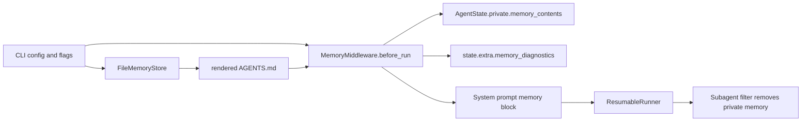

# RFC: Memory Architecture for DeepAgentsRS

- Status: Draft (current-state baseline)
- Scope: `crates/deepagents`, `crates/deepagents-cli`
- Primary implementation anchors:
  - [`memory::protocol`](../../crates/deepagents/src/memory/protocol.rs)
  - [`memory::store_file`](../../crates/deepagents/src/memory/store_file.rs)
  - [`runtime::MemoryMiddleware`](../../crates/deepagents/src/runtime/memory_middleware.rs)
  - [`state::AgentState`](../../crates/deepagents/src/state.rs)
  - [`subagents::protocol`](../../crates/deepagents/src/subagents/protocol.rs)
  - [`deepagents-cli`](../../crates/deepagents-cli/src/main.rs)
  - [`memory_phase7` tests](../../crates/deepagents/tests/memory_phase7.rs)
  - [`e2e_phase4_subagents` tests](../../crates/deepagents-cli/tests/e2e_phase4_subagents.rs)

## Motivation

DeepAgentsRS already ships a real memory subsystem, but the current design note describes a much
larger multi-tenant memory service with user identity graphs, workspace-sharing semantics, semantic
retrieval, and autonomous long-term extraction. That is directionally useful, but it does not match
the architecture that exists in this repository today.

The current system is smaller and more concrete:

- memory is rooted in the local workspace filesystem
- durable entries are stored in a file-backed `MemoryStore`
- model-visible memory is injected from ordered `AGENTS.md` sources at runtime
- loaded memory contents remain private runtime state and are filtered from serialized state and
  subagent inheritance
- CLI workflows exist for minimal durable writes and maintenance

This RFC standardizes that current architecture so the codebase has an accurate memory spec.

It also establishes one central decision:

- DeepAgentsRS memory is currently a root-scoped, file-backed runtime facility.
- Configuration scopes such as `global` and `workspace` are configuration layering concepts, not
  runtime user-tenancy or cross-channel identity semantics.
- Multi-user identity, workspace-shared memory, semantic retrieval, and automatic extraction remain
  future extensions and must not be implied by the base memory contract.

This keeps the design honest, preserves the existing safety and privacy guarantees, and gives the
project a stable platform for later expansion.

## Relationship To `memory-design.md`

This RFC does not fully realize the target architecture proposed in
[`memory-design.md`](./memory-design.md). It documents the baseline that exists in the repository
today and the gaps that remain if DeepAgentsRS wants to adopt that larger design.

| Capability from `memory-design.md` | Status in current RFC / repo | Notes |
| --- | --- | --- |
| Canonical identity graph (`User`, `Thread`, `Workspace`) | Not implemented | Current runtime knows a filesystem root and may carry `thread_id` as extra state, but there is no identity service or tenancy graph |
| Durable memory scopes (`thread`, `user`, `workspace`) | Not implemented | `MemoryEntry` has no scope fields; config `workspace` scope is configuration layering, not runtime sharing |
| Durable memory types (`profile`, `episodic`, `semantic`, `procedural`, `pinned`) | Not implemented | Current entry model is `key` + `value` + `tags` + timestamps |
| Hybrid relational + vector retrieval | Not implemented | Runtime injects an ordered text block; store queries only support `prefix` and `tag` filters |
| Explicit "remember this" protocol | Partially implemented | The agent is told to update memory via file tools, and operators can use `deepagents memory put`, but there is no dedicated runtime memory-write protocol |
| Automatic extraction and consolidation | Not implemented | No write pipeline, summarization job, memory ranking, or consolidation service exists |
| Forgetting, correction, supersession, provenance | Partially implemented | Eviction exists, but there is no delete/edit/supersede/provenance model in the user-facing surface |
| Workspace sharing and permission model | Not implemented | No runtime access-control layer separates personal, shared, and thread-local memory |
| Compact prompt-facing retrieval package | Not implemented | Current model-visible output is a single `<agent_memory>` block, not a structured memory pack |

This means the RFC should be read as:

- a description of the current DeepAgentsRS memory baseline
- a statement of explicit non-goals for the current implementation
- a foundation for future RFCs if the project wants to move toward the larger design

## Requirements

### Functional requirements

- `R1` Ordered source loading: the runtime must load memory from configured filesystem sources in a
  deterministic order.
- `R2` Safe source resolution: memory loading must enforce root-bound path checks by default, with
  explicit opt-in for host paths.
- `R3` Prompt injection: loaded memory must be injected into the provider-visible system prompt
  using a stable marker and stable section tags.
- `R4` Idempotent injection: the same run or resume path must not inject the memory block more than
  once.
- `R5` Private runtime state: raw loaded memory contents must remain in private runtime state and
  must not be serialized into public `RunOutput.state`.
- `R6` Subagent isolation: private memory contents must not be inherited by child runs.
- `R7` Minimal durable store: the core library must expose a small `MemoryStore` abstraction for
  `load`, `flush`, `put`, `get`, `query`, and `evict_if_needed`.
- `R8` Local durable backend: the default backend must persist entries to a local JSON file and
  support deterministic eviction behavior under bounded capacity.
- `R9` Prompt-facing export: the file backend must be able to render a human-readable `AGENTS.md`
  view from stored entries for model consumption and operator inspection.
- `R10` CLI ergonomics: the CLI must support runtime memory loading during `run` and minimal durable
  maintenance through `memory` subcommands.
- `R11` Diagnostics: memory loading must expose structured diagnostics such as loaded source count,
  skipped missing files, truncation, and injected character counts.
- `R12` Deterministic runtime assembly: memory must participate in the runtime middleware chain in a
  stable position relative to other middleware.

### Quality requirements

- `Q1` Bounded prompt growth: the runtime must cap injected memory size and surface truncation.
- `Q2` Predictable failures: missing files, invalid requests, path violations, corrupt store files,
  and I/O failures must surface stable error semantics.
- `Q3` Atomic persistence: file writes must avoid partial-update corruption.
- `Q4` Trait-first extensibility: future backends must be able to implement memory storage without
  changing runtime middleware semantics.
- `Q5` Human operability: the prompt-visible memory representation must remain inspectable as plain
  text and debuggable from the workspace.

### Non-goals

- Canonical `User`, `Workspace`, `ChannelAccount`, or `Thread` identity graphs.
- Cross-channel memory continuity or per-user privacy boundaries beyond the current workspace root.
- Embedding-based retrieval, vector search, or weighted semantic ranking.
- Automatic extraction of memories from arbitrary conversation turns.
- Background consolidation jobs, summarization trees, or long-term episodic/semantic promotion.
- Remote memory services, distributed caches, or database-backed tenancy.

## Architecture

### High-level model

The current memory architecture has three layers:

| Layer | Current component | Responsibility |
| --- | --- | --- |
| Durable storage | `memory::MemoryStore`, `memory::FileMemoryStore` | Persist structured entries, query them, and evict under bounded policy |
| Prompt-facing projection | `FileMemoryStore::render_agents_md` | Render stored entries into a readable `AGENTS.md` view |
| Runtime injection | `runtime::MemoryMiddleware` | Load configured memory sources, keep raw contents private, and inject a stable system block |

This is intentionally smaller than a generic "memory service" design. The system is rooted in the
workspace filesystem and runtime assembly, not in a global identity plane.

### Architectural decisions

- Root scope is the current memory boundary.
- `AGENTS.md` files are the model-visible memory interface.
- `memory_store.json` is the structured durable representation for the default backend.
- Prompt injection is deterministic and eager at `before_run`, not retrieval-driven per query.
- Privacy is enforced by keeping raw contents in `AgentState.private` and excluding them from child
  state handoff.
- The file backend is the only supported backend today, but the trait boundary is real and should be
  preserved.

### Component details

#### 1. Configuration and source model

Memory is configured through the standard config system:

- `memory.backend = "file"`
- `memory.file.enabled = true`
- `memory.file.store_path = ".deepagents/memory_store.json"`
- `memory.file.sources = [".deepagents/AGENTS.md", "AGENTS.md"]`
- `memory.file.allow_host_paths = false`
- `memory.file.max_injected_chars = 30000`

Important boundary:

- Config `workspace` scope controls how configuration values are layered.
- It does not define a runtime workspace-memory namespace or access-control boundary.

#### 2. `MemoryStore` contract

`MemoryStore` is the backend-facing abstraction. Its current contract is deliberately narrow:

- identify the backend with `name()`
- expose active policy with `policy()`
- load and flush durable state
- `put`, `get`, and `query` structured entries
- evict entries when quotas are exceeded

The store entry model is also intentionally small:

- `key`
- `value`
- `tags`
- `created_at`
- `updated_at`
- `last_accessed_at`
- `access_count`

This means the current system does not yet encode:

- memory scopes such as user/workspace/thread
- semantic memory types such as episodic vs procedural
- confidence or salience
- supersession chains
- embeddings or vector references

#### 3. File backend

`FileMemoryStore` is the default and only shipped backend.

Implementation characteristics:

- lazy-loads the JSON store on first use
- persists `MemoryFileV1` with a version field and stored policy
- uses atomic write-then-rename for the JSON file and generated `AGENTS.md`
- applies bounded eviction through `Lru`, `Fifo`, or `Ttl`
- queries by `prefix` and optional `tag`
- updates access metadata on `get` and `query`

The file backend also renders a prompt-facing markdown projection:

- `render_agents_md()` writes an `<auto_generated_memory_v1>` section
- each entry becomes a markdown heading plus its value
- the projection is for model consumption and inspection, not for rich typed recall

This export exists because the runtime memory contract is prompt-oriented. The model consumes text,
not direct `MemoryEntry` structs.

#### 4. Runtime middleware

`MemoryMiddleware` is responsible for runtime loading and prompt injection.

Flow:

1. Resolve configured source paths relative to the run root.
2. Enforce source rules:
   - file name must be `AGENTS.md`
   - symlinks are rejected
   - root escape is rejected unless host paths are explicitly enabled
   - oversized sources fail with quota errors
3. Load all valid sources in declared order.
4. Concatenate loaded content and truncate if it exceeds the injected character budget.
5. Store raw loaded contents in `state.private.memory_contents`.
6. Store public diagnostics in `state.extra.memory_diagnostics`.
7. Insert a single system message containing:
   - `DEEPAGENTS_MEMORY_INJECTED_V1`
   - `<agent_memory>`
   - `<memory_guidelines>`
   - `<memory_diagnostics>`

The middleware does not currently perform retrieval, ranking, query decomposition, or automatic
writes. It is a deterministic prefix injector.

#### 5. Runtime position and privacy boundary

Memory is assembled in a fixed runtime order before skills, filesystem runtime handling,
subagents, summarization, and prompt caching.

That ordering matters:

- memory instructions should be visible to the model before tool selection
- summarization must not erase or reflow the memory block before it reaches the provider
- prompt caching should see the final provider-visible prefix, including memory

Privacy is enforced in two places:

- `AgentState.private` is skipped during serialization, so raw memory contents stay out of public
  `RunOutput.state`
- subagent handoff drops `memory_contents` and resets private state before child execution

#### 6. CLI surfaces

The CLI exposes two memory-facing workflows.

Runtime workflow:

- `deepagents run --memory-source ...`
- `--memory-allow-host-paths`
- `--memory-max-injected-chars`
- `--memory-disable`

Durable maintenance workflow:

- `deepagents memory put`
- `deepagents memory query`
- `deepagents memory compact`

The current CLI is sufficient for:

- black-box writes into the file-backed store
- black-box queries by prefix and tag
- black-box compaction against the store's existing policy
- runtime toggles for source selection, host-path allowance, disablement, and injected-char budget

The current CLI is not sufficient for the full design in `memory-design.md`, or even for all current
memory backend branches. Notable gaps:

- no `memory get`
- no `memory delete`, `memory edit`, `memory pin`, or `memory unpin`
- no explicit scope selection such as thread/user/workspace
- no provenance or supersession inspection
- no user-facing control for automatic memory policy because automatic memory does not exist yet
- no CLI/config surface for `max_source_bytes`
- no CLI/config surface for `strict = false`, so soft-error loader behavior cannot be black-box tested
- no direct CLI surface for switching eviction policy or shrinking capacity, so LRU/FIFO/TTL behavior
  is not easily testable without manually crafting store files

The library trait includes `get`, but the CLI does not currently expose `memory get`. That is a gap
in the user-facing contract, not in the backend abstraction.

### End-to-end flow

### Verification Status

Current repository coverage is real but incomplete. It is stronger at unit/integration level than at
full CLI E2E level.

Covered today:

- [`memory_phase7`](../../crates/deepagents/tests/memory_phase7.rs) verifies store
  `put`/`get`/`query`/`evict_if_needed` behavior and verifies that memory injection is present,
  idempotent, and kept in private state.
- [`e2e_config`](../../crates/deepagents-cli/tests/e2e_config.rs) verifies that CLI/config wiring
  respects a configured memory store path.
- [`e2e_phase4_subagents`](../../crates/deepagents-cli/tests/e2e_phase4_subagents.rs) verifies that
  `memory_contents` is filtered out of child-visible state.

Not covered today by dedicated CLI E2E:

- `deepagents run --memory-source` happy-path validation with direct assertions on injected memory
  diagnostics or provider-visible memory content
- missing-source skip behavior
- outside-root denial
- host-path opt-in behavior
- symlink rejection
- oversize source rejection via `max_source_bytes`
- truncation behavior via `max_injected_chars`
- corrupt `memory_store.json` handling
- black-box testing of multiple eviction policies
- any lifecycle operation that depends on missing CLI commands such as `get`, `delete`, `edit`,
  `pin`, `unpin`, or scope-aware memory management

Because of these gaps, the current CLI and test suite are not strong enough to claim full E2E
coverage of `memory-design.md`. They are also not yet strong enough to black-box every branch of the
current file-backed memory implementation.

That boundary is part of the architecture documentation. Any future change to memory should either:

- preserve the currently covered guarantees, or
- expand the CLI and E2E surface before the RFC claims broader support

## Alternatives

### Alternative A: Adopt the multi-tenant scoped-memory design now

This would introduce `User`, `Workspace`, `Thread`, semantic memory types, and autonomous
retrieval/writes as part of the base architecture.

Rejected for now because:

- the current codebase has no identity graph or access-control plane
- the runtime is rooted in local filesystem state, not service-side tenancy
- it would force a large speculative API surface before the existing local model is fully hardened

### Alternative B: Inject `memory_store.json` directly and drop `AGENTS.md`

This would remove the text projection layer and use the structured store as the only source.

Rejected for now because:

- raw JSON is worse for prompt readability and debugging
- the current system intentionally exposes human-editable memory files
- `AGENTS.md` is already part of the runtime contract and current test expectations

### Alternative C: Make `AGENTS.md` the only canonical store

This would drop the structured JSON store and treat the markdown file as both durable storage and
runtime input.

Rejected for now because:

- eviction and query behavior are much harder to implement over unstructured markdown
- the current typed entry model provides a cleaner backend seam
- the CLI durable operations already target a structured store

### Alternative D: Add automatic memory extraction to the base runtime

This would let the model or middleware promote conversation content into durable memory without an
explicit operator step.

Rejected for now because:

- there is no dedicated approved write protocol beyond generic file editing or CLI maintenance
- privacy and secret-detection policy would become much more complex
- current tests and safety guarantees are centered on explicit, bounded behavior

## Risks

- Dual-source drift: user-edited `AGENTS.md` files and generated `AGENTS.md` output from
  `memory_store.json` can diverge if both are treated as authoritative.
- Prompt-budget pressure: current runtime behavior injects the full loaded memory corpus, so growth
  eventually becomes a prompt-size and cache-key problem.
- Weak structure at runtime: once entries are rendered to text, the provider sees prose, not typed
  memory semantics.
- Local-only scope: the present architecture does not solve multi-user identity, cross-channel
  continuity, or shared-workspace memory.
- Incomplete operator surface: the CLI lacks `memory get` and any delete/forget command, which
  limits manual lifecycle management.
- Verification gap: the RFC can be misread as stronger than the current black-box coverage unless it
  continues to distinguish current tests from target-state E2E requirements.

## Open Questions

- Should `memory_store.json` become the only canonical durable source, with generated `AGENTS.md` clearly marked as derived and not meant for manual editing?
- Should DeepAgentsRS add a dedicated memory tool so the agent can perform structured `put/get` or
  `put/delete` operations instead of relying on generic file editing instructions?
- When user/workspace/thread identity arrives, should it extend `MemoryEntry` directly or be modeled as a higher-level retrieval layer above the current root-scoped store?
- Should the CLI expose `memory get` and `memory delete` before any autonomous memory-writing work?
- Should future retrieval remain prompt-prefix based, or should the runtime evolve toward selective
  retrieval over the store while preserving current privacy and diagnostics guarantees?
- Should DeepAgentsRS add a dedicated memory CLI E2E suite before expanding the RFC beyond the
  current baseline?
